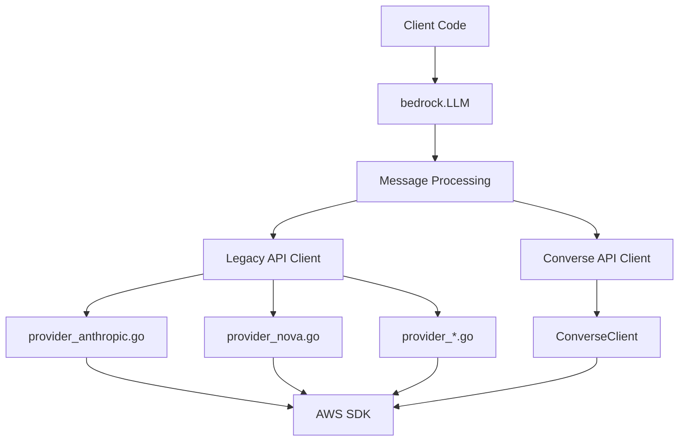
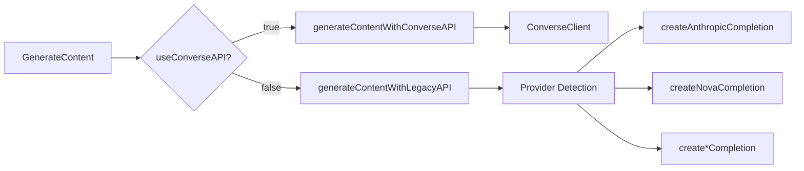
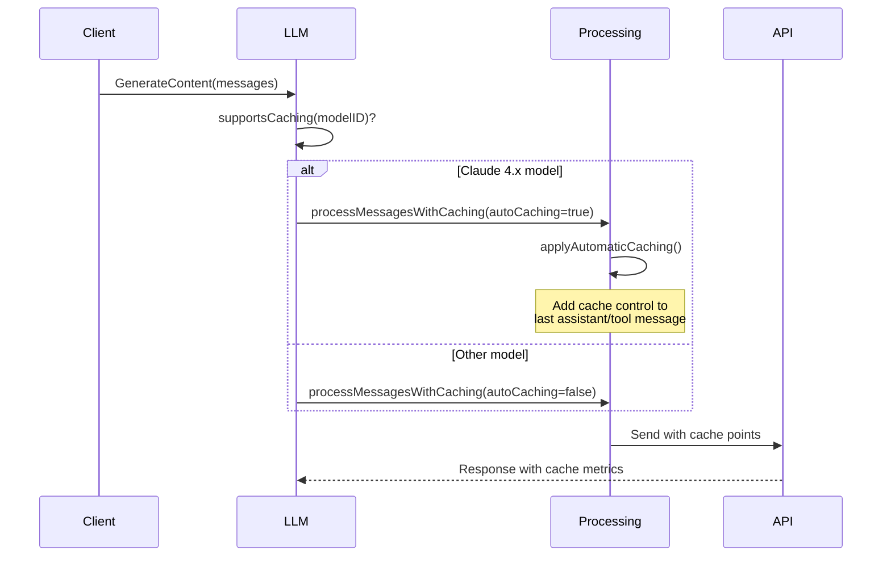
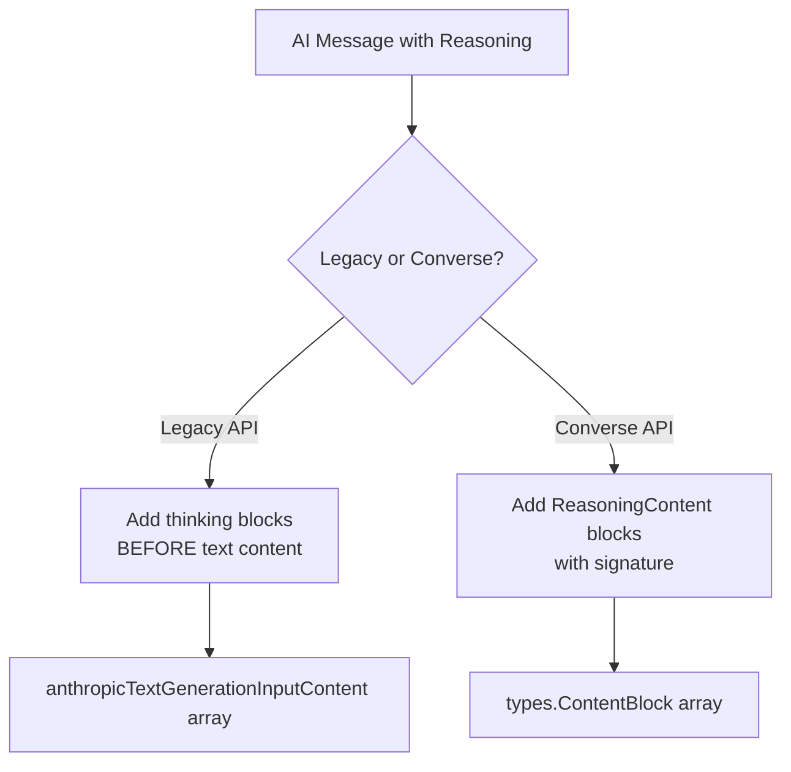
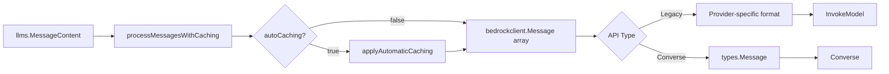

# AWS Bedrock LLM Provider

Production-ready Go client for AWS Bedrock with support for 40+ models from 13 providers.

## Architecture Overview



### Three-Layer Design

**Why this architecture?**

1. **Public API Layer** (`bedrockllm.go`)
   - Single entry point: `bedrock.LLM`
   - Hides complexity of dual API support
   - Manages automatic caching logic

2. **Message Processing Layer** (`processMessages()`)
   - Converts `llms.MessageContent` → `bedrockclient.Message`
   - Handles tool calls, reasoning, multimodal content
   - Applies automatic cache control insertion

3. **Internal Client Layer** (`internal/bedrockclient/`)
   - Provider-specific implementations
   - AWS SDK interaction
   - Response parsing and streaming

## Dual API Strategy

### Why Two APIs?

**Legacy API** (InvokeModel/InvokeModelWithResponseStream):
- Direct access to model-specific features
- Anthropic cache_control format support
- Broader model compatibility
- **Use when**: Model not supported by Converse API

**Converse API** (Converse/ConverseStream):
- Unified interface across all models
- Native cachePoint support (AWS SDK types)
- Better error handling
- **Use when**: Building new applications (recommended)

**Decision Point**: `useConverseAPI` flag in `LLM` struct



## Automatic Prompt Caching

### How It Works

**Challenge**: Anthropic's prompt caching requires manual cache control wrappers on client side.

**Solution**: Automatic cache point insertion for Claude 4.x models.



**Implementation**:
- `supportsCaching()`: Pattern matching on model ID (`claude-opus-4`, `claude-sonnet-4`, `claude-haiku-4`)
- `applyAutomaticCaching()`: Adds `CacheControl{Type: "ephemeral", TTL: "5m"}` to last cacheable message (assistant or tool response)
- **Why last message?** Caches conversation history before new user input
- **TTL Options**: 5 minutes (default) or 1 hour (configurable via `EphemeralCacheOneHour()`)

**Benefits**:
- 90% cost reduction on cached tokens  
- Zero client code changes with automatic caching
- Works with both Legacy and Converse APIs
- Supports both manual (`WithCacheControl()`) and automatic (`WithAutomaticCaching()`) modes

## Tool Calling Implementation

### Provider-Specific Differences

**Why different implementations?**

Different providers use different formats for tool inputs in Converse API:

| Provider | Input Format | Handled By |
|----------|-------------|------------|
| Anthropic | Native JSON objects | `map[string]any` direct |
| Nova | Native JSON objects | `map[string]any` direct |
| Cohere | Native JSON objects | `map[string]any` direct |
| GLM (Z.AI) | **String-based** | Not supported |

**Problems with specific models**:
- **GLM (Z.AI)**: Backend expects tool input as string, not JSON object. This breaks Converse API spec.
- **AI21 Jamba**: Very hard rate limits prevent extensive testing of tool calling capabilities.
- **Meta Llama 3.3/3.1 70B/170B**: Unstable behavior when processing tool call results.
- **Mistral Magistral Small**: Tool calling not supported.
- **Moonshot Kimi K2-Thinking**: Unstable tool calling behavior in streaming mode.
- **Qwen3-VL**: Unstable tool calling in streaming mode.

**Solution**: Models with backend issues or instability are excluded from tool calling tests.

### convertToolCallInput() Logic

**Why this function exists?**

AWS SDK requires Smithy-compatible types for `document.NewLazyDocument()`. Standard Go types from `json.Unmarshal` aren't always compatible.

```go
func convertToolCallInput(args any) (any, error) {
    // 1. Check Smithy compatibility (structs with `document` tags)
    if isSmithyValidObject(args) {
        return args, nil
    }
    
    // 2. Re-encode to normalize types for Smithy SDK
    // Uses UseNumber() to preserve numeric precision during JSON roundtrip
    jsonBytes := bytes.NewBuffer(nil)
    json.NewEncoder(jsonBytes).Encode(args)
    
    decoder := json.NewDecoder(jsonBytes)
    decoder.UseNumber()  // Preserves large numbers accurately
    
    var jsonValue any
    decoder.Decode(&jsonValue)
    return jsonValue, nil
}
```

**Why UseNumber()?**

Preserves numeric precision for large integers that might overflow float64. The `json.Number` type is properly handled by Smithy SDK's document encoding.

### Document Marshal for Tool Responses

**Why `MarshalSmithyDocument()`?**

When extracting tool call from response, `block.Value.Input` is `document.LazyDocument`, not plain Go type:

```go
// WRONG: json.Marshal on document - loses type info
argsJSON, _ := json.Marshal(block.Value.Input)  

// CORRECT: Use MarshalSmithyDocument to get JSON bytes directly
argsJSON, err := block.Value.Input.MarshalSmithyDocument()
if err != nil {
    return fmt.Errorf("failed to marshal tool input: %w", err)
}
// argsJSON is now []byte with the JSON representation
```

## Reasoning (Thinking) Support

### Models Supporting Reasoning

**Converse API**:
- Claude 4.6, 4.5, 4.1, 4.0 (Opus, Sonnet, Haiku)
- DeepSeek R1
- OpenAI GPT OSS (120B, 20B)
- Moonshot Kimi K2-Thinking

**Legacy API**:
- Claude 4.5, 4.1, 4.0 (Opus, Sonnet, Haiku)
- Claude 3.7 Sonnet

**Why these models?**

Extended thinking/reasoning capabilities are model-specific features. DeepSeek R1, OpenAI OSS, and Moonshot models provide reasoning through Converse API, while Anthropic models support both APIs.

### Message Structure with Reasoning



**Why order matters?**

Anthropic API spec requires thinking blocks before text blocks in assistant messages.

### Signature Preservation

**Challenge**: Reasoning signatures must round-trip through conversations.

**Solution**: Store in `reasoning.ContentReasoning.Signature` field, re-insert on next turn.

```go
// Receive
choice.Reasoning.Signature = []byte(...)

// Send back
llms.TextPartWithReasoning(content, reasoning)
```

## Message Processing Pipeline



### Key Transformations

**llms.MessageContent → bedrockclient.Message**:
- Role mapping (System/Human/AI/Tool → provider format)
- Content type detection (Text/Binary/ToolCall/ToolResponse)
- Reasoning extraction and formatting
- Cache control attachment

**bedrockclient.Message → AWS Request**:
- Legacy: JSON serialization with provider schemas
- Converse: AWS SDK types with document encoding

## Adding New Models

### Step-by-Step Process

1. **Add Model Constant** (`models_list.go`)
```go
// Include: Description, max tokens, languages, use cases
ModelNewProvider = "provider.model-id"
```

2. **Update Provider Detection** (if new provider)
```go
// bedrockclient.go
case strings.Contains(modelID, "newprovider"):
    return "newprovider"
```

3. **Implement Provider** (`internal/bedrockclient/provider_new.go`)
```go
func createNewProviderCompletion(ctx, client, modelID, messages, options) {
    // 1. Convert messages to provider format
    // 2. Build request payload
    // 3. Call InvokeModel
    // 4. Parse response
    // 5. Return llms.ContentResponse
}
```

4. **Register in Switch** (`bedrockclient.go`)
```go
case "newprovider":
    return createNewProviderCompletion(...)
```

5. **Add Tests** (`bedrockllm_test.go`)
- Add model to `TestAmazonOutputConverseAPI` models list (if Converse API supported)
- Add model to `TestAmazonOutputLegacyAPI` models list (Legacy API)
- Add model to `TestAmazonStreamingOutputConverseAPI` (if streaming supported)
- Add model to `TestAmazonStreamingOutputLegacyAPI` (if streaming with Legacy API supported)
- Add model to `TestAmazonToolCallingConverseAPI` (if tools supported)
- Add model to `TestAmazonToolCallingLegacyAPI` (if tools with Legacy API supported)
- Add model to `TestAmazonReasoningConverseAPI` (if reasoning/thinking supported)
- Add model to `TestAmazonReasoningLegacyAPI` (if reasoning with Legacy API supported)

6. **Record HTTP Interactions**
```bash
HTTPRR_RECORD=. go test -v -run TestNewModel
```

### Provider Implementation Checklist

- [ ] Input struct with all parameters (Temperature, TopP, MaxTokens, etc.)
- [ ] Output struct matching API response
- [ ] Streaming struct if model supports streaming
- [ ] Error handling for provider-specific errors
- [ ] Token usage extraction
- [ ] Stop reason mapping

## Testing Strategy

### Why httprr?

**Problem**: Integration tests require AWS credentials and cost money.

**Solution**: Record HTTP interactions once, replay for fast tests.

```bash
# Record new interactions
HTTPRR_RECORD=. go test -v -run TestName

# Debug during recording
HTTPRR_RECORD=. HTTPRR_DEBUG=true go test -v -run TestName

# Replay (default)
go test -v -run TestName
```

### Test Organization

**Test File**:

1. **bedrockllm_test.go**: Integration tests (requires AWS credentials)
   - Model output validation (Converse and Legacy API)
   - Streaming behavior (Converse and Legacy API)
   - Tool calling workflows (Converse and Legacy API, with streaming variants)
   - Reasoning roundtrips (Converse and Legacy API, with streaming variants)
   - Caching metrics (automatic and manual caching)
   - Extended thinking with tool calls
   - Multi-turn caching with tools
   - Client creation with different credential types (long-lived, bearer token)

2. **bedrockllm_unit_test.go**: Unit tests (no credentials)
   - Message processing logic
   - Option configuration
   - Cache control application
   - Provider detection

**Why separate files?**

- Unit tests run in CI without credentials
- Integration tests record once, replay forever
- Tool tests validate complex workflows

### Testing Non-Deterministic Tool Calls

**Challenge**: `map[string]any` serialization order is non-deterministic.

```go
// First run: {"a": 15, "b": 8}
// Second run: {"b": 8, "a": 15}  // Different order!
```

**Solution**: Skip second request in replay mode (`isReplaying` check).

```go
if isReplaying {
    return nil  // Don't send tool result
}
```

## Error Handling

### Error Mapping Strategy

**Why custom mapping?**

AWS errors are provider-specific strings. Need standardized codes for client logic.

```go
// errors.go
bedrockErrorMappings = []errorMapping{
    {patterns: []string{"throttlingexception"}, code: llms.ErrCodeRateLimit},
    {patterns: []string{"accessdenied"}, code: llms.ErrCodeAuthentication},
    // ...
}
```

**Usage**:
```go
if llmErr, ok := err.(*llms.Error); ok {
    switch llmErr.Code {
    case llms.ErrCodeRateLimit:
        // Implement backoff
    }
}
```

## Streaming Implementation

### Event Processing Pattern

**Both APIs use AWS SDK event streams**, but different event types:

**Legacy API**:
```go
// Anthropic: streamingCompletionResponseChunk
types: message_start, content_block_delta, message_delta, message_stop
```

**Converse API**:
```go
// AWS SDK types
ConverseStreamOutputMemberContentBlockDelta
ConverseStreamOutputMemberContentBlockStart
ConverseStreamOutputMemberContentBlockStop
```

### Tool Call Streaming Accumulation

**Why accumulation needed?**

Tool arguments arrive in chunks:

```go
// Chunk 1: {"operation"
// Chunk 2: :"multiply","a"
// Chunk 3: :15,"b":8}
```

**Solution**: Accumulate in `streaming.ToolCall` map, send complete call at `ContentBlockStop`.

## Maintenance Guidelines

### When to Use Legacy vs Converse API

**Use Legacy API**:
- Model doesn't support Converse API
- Need Anthropic-specific cache_control format
- Debugging provider-specific issues

**Use Converse API**:
- Default for new implementations
- Better error messages
- Unified tool calling
- Native cachePoint support

### Adding Caching Support

**Criteria**:
1. Model must support Anthropic prompt caching (currently only Claude 4.x)
2. Add pattern to `supportsCaching()` in `bedrockllm.go`:
```go
cachingPatterns := []string{
    "claude-opus-4",
    "claude-sonnet-4",
    "claude-haiku-4",
    "claude-new-4",  // Add new model pattern
}
```
3. Ensure model supports minimum 1024 tokens threshold for cache activation
4. Add tests in `TestAmazonAutomaticCachingConverseAPI` and `TestAmazonAutomaticCachingLegacyAPI`

### Common Pitfalls

**1. Forgetting to handle nil FunctionCall**
```go
// BAD
Name: part.FunctionCall.Name  // Panic if nil

// GOOD
if part.FunctionCall == nil {
    return errors.New("missing function call")
}
```

**2. Ignoring marshal errors**
```go
// BAD
argsJSON, _ := json.Marshal(data)

// GOOD
argsJSON, err := json.Marshal(data)
if err != nil {
    return fmt.Errorf("marshal failed: %w", err)
}
```

**3. Not checking tool call arguments validity**
```go
// BAD - may pass invalid JSON to tool
toolCall.FunctionCall.Arguments  // No validation

// GOOD - validate tool arguments can be parsed
var args map[string]any
if err := json.Unmarshal([]byte(toolCall.FunctionCall.Arguments), &args); err != nil {
    return fmt.Errorf("invalid tool arguments: %w", err)
}
```

## File Organization

```
llms/bedrock/
├── bedrockllm.go              # Main LLM implementation, message processing, caching
├── bedrockllm_option.go       # Configuration options
├── bedrockllm_test.go         # Integration tests (httprr recorded)
├── bedrockllm_unit_test.go    # Unit tests (no AWS required)
├── models_list.go             # Model constants and documentation
├── errors.go                  # Error mapping
├── doc.go                     # Package documentation
├── tool_call_test.go          # Tool call processing tests
├── llmtest_test.go            # LLM interface compliance tests
└── internal/bedrockclient/
    ├── bedrockclient.go           # Legacy API client
    ├── bedrockclient_converse.go  # Converse API client
    ├── bedrockclient_util.go      # Smithy validation
    ├── bedrockclient_test.go      # Client tests
    ├── bedrockclient_integration_test.go  # Client integration tests
    ├── provider_anthropic.go      # Anthropic-specific implementation
    ├── provider_nova.go           # Nova-specific implementation
    ├── provider_*.go              # Other providers
    └── *_test.go                  # Provider tests
```

## Key Design Decisions

### Why Separate Provider Files?

**Problem**: Single file would be 5000+ lines with mixed concerns.

**Solution**: Each provider in separate file with consistent interface.

**Benefits**:
- Easy to add new providers
- Clear separation of model-specific logic
- Isolated testing

### Why Two Cache Control Formats?

**Legacy API**: Anthropic's `cache_control` in message content
```json
{
  "type": "text",
  "text": "...",
  "cache_control": {"type": "ephemeral", "ttl": "5m"}
}
```

**Converse API**: AWS's `cachePoint` blocks
```json
{
  "content": [
    {"text": "..."},
    {"cachePoint": {"type": "default", "ttl": "fiveMinutes"}}
  ]
}
```

**Why support both?**
- Legacy API: Anthropic `cache_control` format required (embedded in content blocks)
- Converse API: AWS `cachePoint` format required (separate content block type)
- Automatic caching abstracts the difference by using appropriate format based on API

### Message Processing: Content Parts to Messages

**Key Insight**: `llms.MessageContent` supports multiple content parts (text, images, tool calls), but provider APIs may require them as separate messages or flattened arrays.

**Processing Flow**:
```go
// Input: Single MessageContent with multiple parts
llms.MessageContent{
    Role: llms.ChatMessageTypeHuman,
    Parts: [TextPart("Describe"), BinaryPart(imageData)]
}

// Output: Flat message array for provider API
[
    Message{Type: "text", Content: "Describe"},
    Message{Type: "image", Content: base64Data, MimeType: "image/jpeg"}
]
```

**Why flatten?**
- Anthropic Legacy API: Requires flat content array per message
- Nova/other providers: Each content type is separate array element
- Simplifies provider-specific serialization logic

## Debugging Guide

### Enable HTTP Logging

```bash
HTTPRR_DEBUG=true go test -v -run TestName
```

### Check Cache Metrics

```go
resp.Choices[0].GenerationInfo["CacheReadInputTokens"]      // Tokens read from cache
resp.Choices[0].GenerationInfo["CacheCreationInputTokens"]  // Tokens written to cache
```

### Validate Tool Call Arguments

Look for empty `Arguments` in logs - indicates parsing issue:
```go
if len(arguments) == 0 {
    // Check FunctionCall.Arguments JSON validity
}
```

### Common Errors

**"unsupported message type"**
- Added new ContentPart type without handling in processMessages()

**"role not supported"**
- Provider doesn't support message role (e.g., Function role)

**"completed due to max_tokens"**
- Increase MaxTokens in request

**"cached HTTP response not found"**
- httprr recording changed, re-record with `HTTPRR_RECORD=.`

## Performance Considerations

### Automatic Caching Impact

**First request**: Cache creation overhead (~50ms)
**Subsequent requests**: 90% token cost reduction, ~20% latency reduction

**Best for**:
- Long conversations (3+ turns)
- Large system prompts (>1024 tokens)
- Repeated context (tools, RAG documents)

### Streaming Latency

**Time to first token**: 200-500ms (depending on model)
**Chunk frequency**: Every 20-50ms

**Use streaming when**:
- User-facing chat interfaces
- Long responses (>500 tokens)
- Real-time feedback needed

## Future Enhancements

### Potential Improvements

1. **Converse API Migration**
   - Move all models to Converse API
   - Deprecate Legacy API providers
   - Why: Simpler maintenance, better consistency

2. **Smart Cache TTL Selection**
   - 5m for short conversations
   - 1h for long sessions
   - Why: Optimize cost vs cache hit rate

3. **Parallel Tool Calls**
   - Support multiple simultaneous tools
   - Why: Some models return parallel tool calls

4. **Structured Output**
   - JSON schema validation
   - Why: Type-safe responses

## Contributing

### Before Adding Features

1. Check if Converse API supports it natively
2. Consider impact on both API paths
3. Add tests for both streaming and non-streaming
4. Update httprr recordings

### Code Review Checklist

- [ ] Error handling for all AWS SDK calls
- [ ] Nil checks for optional fields
- [ ] Cache control doesn't break non-caching models
- [ ] Tool calling tested with real model
- [ ] httprr recordings committed
- [ ] Documentation updated

## Supported Model Matrix

| Provider | Tool Calling | Reasoning | Streaming | Multimodal | Caching |
|----------|-------------|-----------|-----------|------------|---------|
| Claude 4.6 | ✅ | ✅ | ✅ | ✅ | ✅ |
| Claude 4.5 | ✅ | ✅ | ✅ | ✅ | ✅ |
| Claude 4.1 | ✅ | ✅ | ✅ | ✅ | ✅ |
| Claude 4.0 | ✅ | ✅ | ✅ | ✅ | ✅ |
| Claude 3.7 | ✅ | ✅ | ✅ | ❌ | ❌ |
| Claude 3.5 | ✅ | ❌ | ✅ | ❌ | ❌ |
| Nova 2/Pro/Lite | ✅ | ❌ | ✅ | ✅ | ❌ |
| Llama 4 | Limited | ❌ | ✅ | ✅ | ❌ |
| Cohere R+ | ✅ | ❌ | ✅ | ❌ | ❌ |
| DeepSeek V3.2 | ✅ | ❌ | ✅ | ❌ | ❌ |
| DeepSeek R1 | ❌ | ✅ | ✅ | ❌ | ❌ |
| AI21 Jamba | Limited* | ❌ | ✅** | ❌ | ❌ |
| OpenAI GPT (OSS) | ✅ | ✅ | ✅ | ❌ | ❌ |
| Qwen3 | Varies*** | ❌ | ✅ | Some | ❌ |
| Mistral | ✅**** | ❌ | ✅ | ❌ | ❌ |
| Moonshot Kimi | ✅***** | ✅ | ✅ | ❌ | ❌ |
| GLM-4.7 | ❌****** | ❌ | ✅ | ❌ | ❌ |

*AI21 Jamba: Rate limits prevent extensive tool calling testing  
**AI21 Jamba: Streaming supported only with Converse API  
***Qwen3: Most models support tools, except Qwen3-VL (unstable in streaming)  
****Mistral: Large3 and Large2402 support tools, MagistralSmall2509 does not  
*****Moonshot: K2.5 supports tools, K2-Thinking is unstable  
******GLM models: Backend incompatibility with Converse API tool format (requires string instead of JSON)

See `models_list.go` for complete model list and detailed capabilities.
