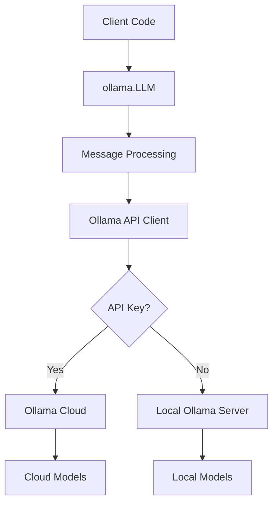
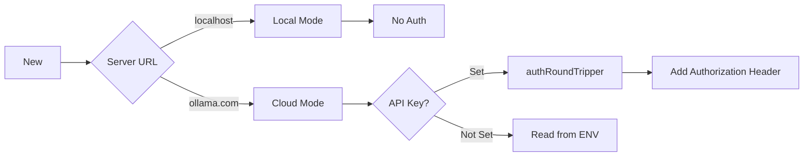
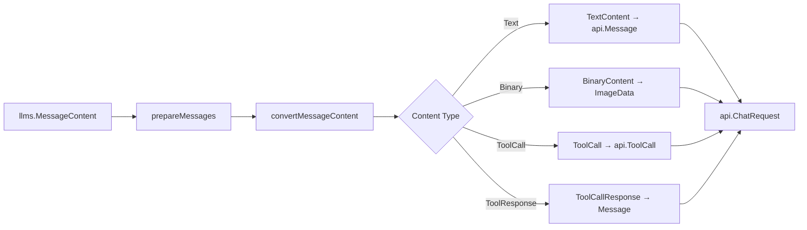
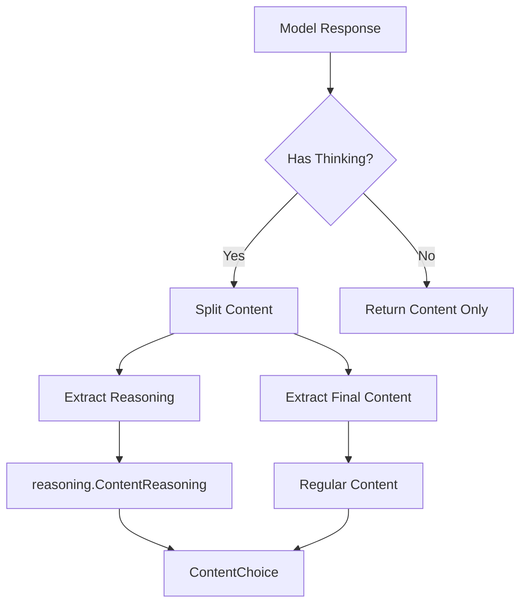
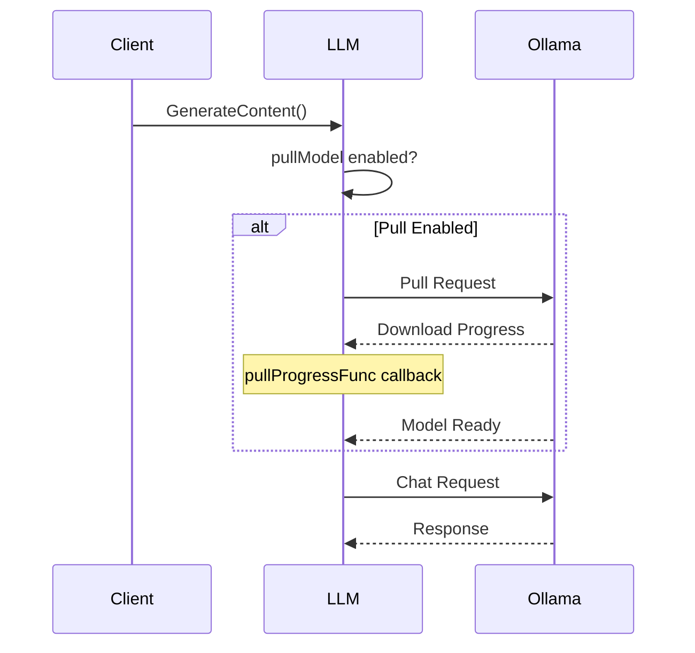

# Ollama LLM Provider

Production-ready Go client for Ollama with support for local and cloud deployment, 100+ open-source models, and advanced features like tool calling, reasoning, and multimodal processing.

## Architecture Overview



### Two-Layer Design

**Why this architecture?**

1. **Public API Layer** (`ollamallm.go`)
   - Single entry point: `ollama.LLM`
   - Unified interface for local and cloud deployments
   - Automatic model downloading with pull mechanism

2. **API Client Layer** (Ollama SDK)
   - Official Ollama Go SDK (`github.com/ollama/ollama/api`)
   - Handles HTTP communication
   - Manages streaming responses
   - Authentication for cloud access

## Deployment Modes

### Local vs Cloud Deployment

**Local Deployment** (Default):
- Run models on your own hardware
- No API key required
- Full privacy and control
- GPU acceleration support
- **Use when**: Privacy is critical, you have capable hardware

**Cloud Deployment** (Ollama Cloud):
- Access powerful models without local GPU
- Requires API key from https://ollama.com/settings/keys
- Pay-per-use pricing
- Managed infrastructure
- **Use when**: Running large models (70B+), no local GPU



### Configuration Examples

**Local Deployment**:
```go
llm, err := ollama.New(
    ollama.WithModel("llama3.2"),
    // Server URL defaults to http://localhost:11434
)
```

**Cloud Deployment**:
```go
llm, err := ollama.New(
    ollama.WithServerURL(ollama.CloudURL),
    ollama.WithAPIKey("your-api-key"),  // or set OLLAMA_API_KEY env var
    ollama.WithModel("gpt-oss:120b"),
)
```

**Why Separate Modes?**

- Local: Zero-cost, unlimited usage, full privacy
- Cloud: No hardware requirements, instant access to large models
- Automatic detection: API key only applied to non-localhost URLs

## Authentication Layer

### authRoundTripper Implementation

**Challenge**: Ollama Cloud requires Bearer token authentication, but we need to preserve custom HTTP clients.

**Solution**: Proxy RoundTripper that adds Authorization header without replacing the underlying transport.

```go
type authRoundTripper struct {
    apiKey    string
    transport http.RoundTripper
}

func (a *authRoundTripper) RoundTrip(req *http.Request) (*http.Response, error) {
    clonedReq := req.Clone(req.Context())
    clonedReq.Header.Set("Authorization", "Bearer "+a.apiKey)
    return a.transport.RoundTrip(clonedReq)
}
```

**Why Proxy Pattern?**

- Preserves custom HTTP client settings (timeouts, TLS config)
- No modification of original transport
- Works with httprr for testing
- Clean separation of concerns

### API Key Priority

1. Explicit `WithAPIKey()` option (highest priority)
2. `OLLAMA_API_KEY` environment variable
3. No key if not provided

```go
// Priority resolution
if o.apiKey == "" {
    if envKey := os.Getenv("OLLAMA_API_KEY"); envKey != "" {
        o.apiKey = envKey
    }
}
```

**Note**: API key is applied to all requests when set. For testing, use `rr.ScrubReq()` to remove the Authorization header from httprr recordings.

## Message Processing Pipeline



### Key Transformations

**llms.MessageContent → api.Message**:

```go
// Input: LangChainGo format
llms.MessageContent{
    Role: llms.ChatMessageTypeHuman,
    Parts: [
        llms.TextContent{Text: "Describe this image"},
        llms.BinaryContent{Data: imageBytes, MimeType: "image/jpeg"},
    ],
}

// Output: Ollama format
api.Message{
    Role: "user",
    Content: "Describe this image",
    Images: []api.ImageData{imageBytes},
}
```

**Why Flatten Parts?**

- Ollama API expects single text content per message
- Images are separate `Images` field
- Multiple text parts are concatenated with separators

## Tool Calling Implementation

### Ollama Tool Format

**Ollama uses OpenAI-compatible tool calling format**:

```json
{
  "tools": [
    {
      "type": "function",
      "function": {
        "name": "getWeather",
        "description": "Get weather for a location",
        "parameters": {
          "type": "object",
          "required": ["location"],
          "properties": {
            "location": {"type": "string", "description": "City name"}
          }
        }
      }
    }
  ]
}
```

### Tool Call Processing

**Challenge**: Convert between LangChainGo and Ollama formats while preserving tool call IDs.

**Solution**: Consistent ID generation using CRC32 hash.

```go
func makeToolCallID(index int, name string) string {
    hash := crc32.NewIEEE().Sum([]byte(name))
    encHash := hex.EncodeToString(hash)
    return fmt.Sprintf("ollama-%s-%d", encHash, index)
}

func parseToolCallID(id string) int {
    parts := strings.Split(id, "-")
    if len(parts) == 3 {
        index, _ := strconv.Atoi(parts[2])
        return index
    }
    // Fallback: hash the ID
    return int(crc32.ChecksumIEEE([]byte(id)))
}
```

**Why CRC32?**

- Fast, deterministic hashing
- Generates consistent IDs across requests
- Reversible (index is embedded in ID)
- Compatible with tool call continuation

### Tool Response Handling

```go
// Convert tool response to Ollama message
case llms.ToolCallResponse:
    msg := api.Message{
        Role: "tool",
        Content: pt.Content,
    }
```

**Order Matters**:
1. User message with question
2. Assistant message with tool calls
3. Tool messages with responses
4. Assistant message with final answer

## Reasoning (Thinking) Support

### Models with Reasoning

**Ollama models supporting extended thinking**:
- DeepSeek R1
- QwQ 32B
- GLM-4.7 (thinking variants)
- Custom models with `<thinking>` tags

**Why Reasoning Support?**

Models with reasoning capabilities provide step-by-step thought process before final answer, improving accuracy on complex tasks.

### Reasoning Message Structure



### Processing Reasoning Content

**Why `reasoning.ChunkContentSplitter`?**

Streaming responses may interleave reasoning and regular content chunks:

```go
splitter := reasoning.NewChunkContentSplitter()

fn := func(response api.ChatResponse) error {
    textContent, reasoningContent := splitter.Split(response.Message.Content)
    
    // Send reasoning chunks
    if reasoningContent != "" {
        reasoning := &reasoning.ContentReasoning{Content: reasoningContent}
        streaming.CallWithReasoning(ctx, opts.StreamingFunc, reasoning)
    }
    
    // Send text chunks
    if textContent != "" {
        streaming.CallWithText(ctx, opts.StreamingFunc, textContent)
    }
}
```

**Benefits**:
- Separate reasoning from final answer
- Streaming support for both content types
- Compatible with LangChainGo's reasoning interface

## Model Management

### Automatic Model Pulling

**Challenge**: Models must be available locally or in cloud before use.

**Solution**: Automatic download with `WithPullModel()` option.



### Pull Configuration

```go
llm, err := ollama.New(
    ollama.WithModel("llama3.2"),
    ollama.WithPullModel(),
    ollama.WithPullTimeout(10*time.Minute),
    ollama.WithPullProgressFunc(func(resp api.ProgressResponse) error {
        fmt.Printf("Downloading: %d/%d\n", resp.Completed, resp.Total)
        return nil
    }),
)
```

**Pull Timeout Handling**:

```go
pullCtx, cancel := context.WithTimeoutCause(ctx, o.options.pullTimeout, ErrPullTimeout)
defer cancel()

err := o.client.Pull(pullCtx, req, progress)
if errors.Is(err, context.DeadlineExceeded) {
    return err
}
```

**Why Separate Timeout?**

- Large models (70B) can take 10-30 minutes to download
- Separate timeout prevents hanging on slow connections
- Graceful error handling with specific error cause

### Model Keep-Alive

**Memory Management**: Models stay loaded in RAM/VRAM for faster subsequent requests.

```go
WithKeepAlive("5m")   // Keep loaded for 5 minutes (default)
WithKeepAlive("30m")  // Keep for 30 minutes
WithKeepAlive("-1")   // Keep indefinitely
WithKeepAlive("0")    // Unload immediately
```

**Why Keep-Alive Matters?**

- First request: 1-3 seconds (model loading)
- Cached request: 50-200ms (model already loaded)
- Trade-off: Memory usage vs response time

## Configuration Options

### Performance Tuning

**GPU Configuration**:
```go
WithRunnerNumGPU(-1)      // Auto-detect optimal GPU usage
WithRunnerNumGPU(0)       // CPU only
WithRunnerNumGPU(1)       // Offload to 1 GPU
WithRunnerMainGPU(0)      // Primary GPU for multi-GPU setups
```

**Context Window**:
```go
WithRunnerNumCtx(2048)    // Default context size
WithRunnerNumCtx(8192)    // Larger context for long conversations
WithRunnerNumCtx(32768)   // Maximum context (memory intensive)
```

**CPU Threads**:
```go
WithRunnerNumThread(0)    // Auto-detect (default)
WithRunnerNumThread(4)    // Limit to 4 threads
WithRunnerNumThread(16)   // Use 16 threads (high-core CPUs)
```

**Batch Processing**:
```go
WithRunnerNumBatch(512)   // Default batch size
WithRunnerNumBatch(1024)  // Larger batches (faster on powerful GPUs)
WithRunnerNumBatch(256)   // Smaller batches (lower memory usage)
```

### Generation Parameters

**Temperature Control**:
```go
llms.WithTemperature(0.0)   // Deterministic output
llms.WithTemperature(0.7)   // Balanced creativity (default)
llms.WithTemperature(1.0)   // More creative/random
```

**Sampling Options**:
```go
WithTopK(40)              // Limit token selection to top K choices
WithTopP(0.9)             // Nucleus sampling threshold
WithMinP(0.05)            // Minimum probability threshold
WithTypicalP(1.0)         // Locally typical sampling
```

**Repetition Control**:
```go
WithPredictRepeatPenalty(1.1)        // Penalize repeated tokens
WithPredictPresencePenalty(0.0)      // Penalize token presence
WithPredictFrequencyPenalty(0.0)     // Penalize token frequency
WithPredictRepeatLastN(64)           // Look-back window for penalties
```

**Output Control**:
```go
llms.WithMaxTokens(512)              // Limit response length
WithPredictStop([]string{"\n\n"})    // Custom stop sequences
llms.WithSeed(42)                    // Reproducible outputs
```

### Memory Optimization

**Memory Mapping**:
```go
WithRunnerUseMMap(true)   // Use memory-mapped files (efficient)
WithRunnerUseMMap(false)  // Load entire model to RAM (faster)
```

**Keep Tokens**:
```go
WithRunnerNumKeep(4)      // Retain 4 tokens when context resets
WithRunnerNumKeep(0)      // Complete reset on context overflow
```

## Streaming Implementation

### Event Processing Pattern

**Ollama streams responses in SSE (Server-Sent Events) format**:

```go
stream := true
req := &api.ChatRequest{
    Model:    model,
    Messages: messages,
    Stream:   &stream,
}

err := client.Chat(ctx, req, func(resp api.ChatResponse) error {
    // Process each chunk
    if !resp.Done {
        streamedContent += resp.Message.Content
    }
    return nil
})
```

### Streaming with Tool Calls

**Challenge**: Tool calls may arrive in chunks.

**Solution**: Accumulate until `Done` flag is true.

```go
var streamedToolCalls []api.ToolCall

fn := func(response api.ChatResponse) error {
    // Accumulate content
    if response.Message.Content != "" {
        streamedResponse += response.Message.Content
    }
    
    // Accumulate tool calls
    if len(response.Message.ToolCalls) > 0 {
        streamedToolCalls = append(streamedToolCalls, response.Message.ToolCalls...)
    }
    
    // Final response when Done
    if response.Done {
        resp = response
        resp.Message = api.Message{
            Role:      "assistant",
            Content:   streamedResponse,
            ToolCalls: streamedToolCalls,
        }
    }
    return nil
}
```

### Reasoning-Aware Streaming

**Why Split Content?**

Reasoning content should be processed separately from regular content:

```go
splitter := reasoning.NewChunkContentSplitter()

fn := func(response api.ChatResponse) error {
    textContent, reasoningContent := splitter.Split(response.Message.Content)
    
    // Stream reasoning chunks to special handler
    if opts.StreamingFunc != nil && reasoningContent != "" {
        reasoning := &reasoning.ContentReasoning{Content: reasoningContent}
        streaming.CallWithReasoning(ctx, opts.StreamingFunc, reasoning)
    }
    
    // Stream text chunks to regular handler
    if opts.StreamingFunc != nil && textContent != "" {
        streaming.CallWithText(ctx, opts.StreamingFunc, textContent)
    }
    
    return nil
}
```

## Testing Strategy

### Why httprr?

**Problem**: Integration tests require running Ollama server (local or cloud) and cost API credits.

**Solution**: Record HTTP interactions once, replay for fast tests.

```bash
# Record cloud interactions (requires OLLAMA_API_KEY)
HTTPRR_RECORD=. go test -v -run TestCloud

# Replay recorded interactions (no server needed)
go test -v -run TestCloud

# Debug during recording
HTTPRR_RECORD=. HTTPRR_DEBUG=true go test -v -run TestCloud
```

### Test Organization

**Test Files**:

1. **ollama_test.go**: Local server integration tests
   - Basic generation
   - Tool calling
   - Streaming
   - JSON mode
   - Model pulling
   - Embeddings

2. **ollama_cloud_test.go**: Cloud integration tests
   - Cloud model generation
   - Cloud streaming
   - Cloud tool calling
   - Cloud JSON mode
   - Various options (temperature, seed)
   - Uses `httprr.SkipIfNoCredentialsAndRecordingMissing("OLLAMA_API_KEY")` to skip when no credentials

3. **llmtest_test.go**: Interface compliance tests
   - Validates `llms.Model` interface implementation

**Why Separate Local and Cloud?**

- Different authentication (no key vs API key)
- Different model availability
- Different performance characteristics
- Different scrubbing requirements (cloud needs both header and query param removal)

**Creating New Test Files**:

```go
func newTestClient(t *testing.T, opts ...Option) *LLM {
    // 1. Check credentials first
    httprr.SkipIfNoCredentialsAndRecordingMissing(t, "OLLAMA_API_KEY")
    
    // 2. Open httprr
    rr := httprr.OpenForTest(t, httputil.DefaultTransport)
    
    // 3. Configure scrubbing
    rr.ScrubReq(func(req *http.Request) error {
        req.Header.Del("Authorization")
        return nil
    })
    
    // 4. Create client with httprr transport
    opts = append([]Option{
        WithHTTPClient(rr.Client()),
    }, opts...)
    
    return ollama.New(opts...)
}
```

### Request Scrubbing for httprr

**Challenge**: Dynamic headers and query parameters break httprr recording/replay.

**Solution**: Combine transport wrapper (for query params) and `rr.ScrubReq()` (for headers).

**Local Tests**:
```go
rr.ScrubReq(func(req *http.Request) error {
    // Remove Authorization header to avoid leaking API key
    req.Header.Del("Authorization")
    return nil
})
```

**Cloud Tests**:
```go
// 1. Wrap transport to remove ts parameter BEFORE httprr
type removeTimestampTransport struct {
    base http.RoundTripper
}

func (t *removeTimestampTransport) RoundTrip(req *http.Request) (*http.Response, error) {
    clonedReq := req.Clone(req.Context())
    q := clonedReq.URL.Query()
    q.Del("ts")  // Remove Ollama's timestamp for consistent matching
    clonedReq.URL.RawQuery = q.Encode()
    return t.base.RoundTrip(clonedReq)
}

// 2. Use wrapper before httprr
baseTransport := &removeTimestampTransport{base: httputil.DefaultTransport}
rr := httprr.OpenForTest(t, baseTransport)

// 3. Scrub Authorization header
rr.ScrubReq(func(req *http.Request) error {
    req.Header.Del("Authorization")
    return nil
})

// 4. Wrap rr.Client() for final client
wrappedClient := &http.Client{
    Transport: &removeTimestampTransport{base: rr.Client().Transport},
    Timeout: rr.Client().Timeout,
}
```

**Why Two Layers?**

- **Transport wrapper**: Removes `ts` before request reaches httprr (preserves request body)
- **Scrub header**: Removes Authorization from recorded requests (prevents API key leakage)
- **Wrapper on client**: Ensures ts removal works in both recording and replay modes

**Why Not Scrub Query Params?**

- Scrubbing modifies request → may cause chunked encoding issues
- Transport wrapper preserves original request structure
- Cleaner separation: transport handles URL, scrubber handles headers

**Benefits**:
- Tests work with or without `OLLAMA_API_KEY` set
- No API key leakage in committed recordings
- Correct request body preservation
- Consistent behavior across development environments

## Error Handling

### Common Errors

**Model Not Found**:
```go
// Error: "model 'llama3' not found"
// Solution: Pull the model first
llm, _ := ollama.New(
    ollama.WithModel("llama3"),
    ollama.WithPullModel(),
)
```

**Connection Refused**:
```go
// Error: "connect: connection refused"
// Solution: Start Ollama server or check URL
ollama serve  // Start local server
```

**API Key Error (Cloud)**:
```go
// Error: "unauthorized" or "authentication required"
// Solution: Set valid API key
os.Setenv("OLLAMA_API_KEY", "your-key")
```

**Context Length Exceeded**:
```go
// Error: "context length exceeded"
// Solution: Increase context size or reduce message history
llm, _ := ollama.New(
    ollama.WithRunnerNumCtx(8192),  // Increase from default 2048
)
```

## File Organization

```
llms/ollama/
├── ollamallm.go              # Main LLM implementation
├── options.go                # Configuration options
├── ollama_test.go            # Local server integration tests
├── ollama_cloud_test.go      # Cloud integration tests
├── llmtest_test.go           # Interface compliance tests
└── testdata/
    ├── TestGenerateContent.httprr      # Recorded local interactions
    ├── TestCloudGenerateContent.httprr # Recorded cloud interactions
    └── ...                             # Other test recordings
```

## Key Design Decisions

### Why No Custom Provider Files?

**Unlike Bedrock**: Ollama uses official SDK that handles all model differences.

**Benefits**:
- Single code path for all models
- SDK updates automatically support new models
- No provider-specific serialization logic
- Simpler maintenance

### Why No Hostname-Based API Key Filtering?

**Problem**: Users might set `OLLAMA_API_KEY` globally.

**Alternative Rejected**: Filter API key by hostname (only apply to non-localhost).

**Why Not?**
- Someone might run authenticated Ollama on localhost
- Testing should handle dynamic headers via httprr scrubbing, not client code
- Client code should be simple: apply API key if provided
- Test infrastructure handles environment differences

**Solution**: Use `rr.ScrubReq()` in tests.

```go
// Tests handle environment, not client code
rr.ScrubReq(func(req *http.Request) error {
    req.Header.Del("Authorization")  // Remove if set from env
    return nil
})
```

**Benefits**:
- Simpler client code (no special cases)
- Tests work regardless of environment variables
- No API key leakage in recordings
- Follows separation of concerns principle

### Why Proxy Transport Pattern?

**Alternative**: Replace entire HTTP client.

**Problem**: Loses custom settings (timeouts, TLS config, httprr transport).

**Solution**: Wrap transport in auth layer, preserve rest.

**Benefits**:
- Works with testing infrastructure (httprr)
- Preserves custom HTTP client configurations
- Clean separation of auth concern
- Easy to test independently

## Performance Considerations

### Local Deployment

**First Request Latency**:
- Model loading: 1-3 seconds (varies by model size)
- Generation: 50-500ms per token (depends on hardware)

**Subsequent Requests**:
- No loading overhead if within keep-alive window
- 50-200ms time to first token
- Consistent token generation rate

**Optimization Tips**:
```go
// Keep model loaded for active sessions
WithKeepAlive("30m")

// Use GPU acceleration
WithRunnerNumGPU(-1)  // Auto-detect

// Increase batch size for throughput
WithRunnerNumBatch(1024)

// Reduce context for memory savings
WithRunnerNumCtx(2048)
```

### Cloud Deployment

**Latency**:
- Network overhead: 50-100ms
- Time to first token: 200-500ms
- Throughput: Depends on model size

**Cost Optimization**:
- Use appropriate model size for task
- Stream responses for better UX
- Implement caching at application level
- Monitor token usage via `GenerationInfo`

## Debugging Guide

### Enable Verbose Logging

**Ollama Server Logs**:
```bash
# Local server
OLLAMA_DEBUG=1 ollama serve

# View logs
tail -f ~/.ollama/logs/server.log
```

**HTTP Traffic Logging**:
```go
import "github.com/vxcontrol/langchaingo/httputil"

llm, _ := ollama.New(
    ollama.WithHTTPClient(httputil.LoggingClient),  // Logs all requests
)
```

### Check Model Status

```bash
# List available models
ollama list

# Show model details
ollama show llama3.2

# Check running models
ollama ps
```

### Validate Configuration

```go
// Test basic connectivity
resp, err := llm.GenerateContent(ctx, []llms.MessageContent{
    {
        Role: llms.ChatMessageTypeHuman,
        Parts: []llms.ContentPart{
            llms.TextContent{Text: "Hello"},
        },
    },
})

if err != nil {
    // Check error type
    log.Printf("Error: %v", err)
}

// Check token usage
tokens := resp.Choices[0].GenerationInfo["TotalTokens"]
log.Printf("Used %v tokens", tokens)
```

## Supported Models

### Local Models

**Llama Family**:
- Llama 3.3 (70B, 405B - instruct variants)
- Llama 3.2 (1B, 3B, 11B, 90B - vision variants)
- Llama 3.1 (8B, 70B, 405B)

**Mistral**:
- Mistral Large (123B)
- Mixtral 8x7B, 8x22B
- Mistral Small, Nemo

**Others**:
- Gemma 2 (2B, 9B, 27B)
- Qwen 2.5 (0.5B - 72B)
- DeepSeek V3, R1
- Phi 3.5, 4
- And 100+ more models

### Cloud Models

**OpenAI OSS**:
- gpt-oss:120b-cloud
- gpt-oss:20b-cloud

**Why Cloud Suffix?**

Models ending in `-cloud` are automatically routed to Ollama's cloud infrastructure, allowing access to larger models without local GPU requirements.

**Model Selection Guidelines**:

| Use Case | Recommended Model | Size |
|----------|------------------|------|
| Chat Assistant | llama3.2 | 3B |
| Code Generation | codellama | 7B-34B |
| Reasoning Tasks | deepseek-r1 | 32B |
| Vision Tasks | llama3.2-vision | 11B-90B |
| Large Context | llama3.1 | 70B |
| Cloud (No GPU) | gpt-oss:120b-cloud | 120B |

## Contributing

### Before Adding Features

1. Check if Ollama SDK already supports it
2. Test with both local and cloud deployments
3. Add tests for both streaming and non-streaming
4. Update httprr recordings
5. Document new options in `options.go`

### Code Review Checklist

- [ ] Error handling for Ollama API calls
- [ ] Nil checks for optional fields
- [ ] API key doesn't break local deployment
- [ ] Tool calling tested with real model
- [ ] httprr recordings committed
- [ ] Documentation updated in README.md

## Feature Matrix

| Feature | Local | Cloud | Notes |
|---------|-------|-------|-------|
| Text Generation | ✅ | ✅ | All models |
| Streaming | ✅ | ✅ | All models |
| Tool Calling | ✅ | ✅ | Most models |
| Reasoning | ✅ | ✅ | DeepSeek R1, QwQ, etc. |
| Vision (Images) | ✅ | ❌ | llama3.2-vision, etc. |
| JSON Mode | ✅ | ✅ | Compatible models only |
| Embeddings | ✅ | ❌ | nomic-embed-text, etc. |
| Auto Model Pull | ✅ | ❌ | Local only |
| Custom Templates | ✅ | ❌ | Local only |
| GPU Acceleration | ✅ | N/A | Local hardware dependent |
| API Authentication | ❌ | ✅ | Cloud requires API key |

## Advanced Usage Examples

### Multi-Turn Conversation with Tools

```go
llm, _ := ollama.New(
    ollama.WithModel("llama3.2"),
)

messages := []llms.MessageContent{
    {
        Role: llms.ChatMessageTypeHuman,
        Parts: []llms.ContentPart{
            llms.TextContent{Text: "What's 15 * 7?"},
        },
    },
}

tools := []llms.Tool{{
    Type: "function",
    Function: &llms.FunctionDefinition{
        Name: "calculator",
        Description: "Perform arithmetic operations",
        Parameters: map[string]any{
            "type": "object",
            "required": []string{"operation", "a", "b"},
            "properties": map[string]any{
                "operation": map[string]any{"type": "string", "enum": []string{"add", "multiply"}},
                "a": map[string]any{"type": "number"},
                "b": map[string]any{"type": "number"},
            },
        },
    },
}}

// First request - model calls tool
resp, _ := llm.GenerateContent(ctx, messages, llms.WithTools(tools))
toolCall := resp.Choices[0].ToolCalls[0]

// Add assistant message with tool call
messages = append(messages, llms.MessageContent{
    Role: llms.ChatMessageTypeAI,
    Parts: []llms.ContentPart{toolCall},
})

// Execute tool and add response
messages = append(messages, llms.MessageContent{
    Role: llms.ChatMessageTypeTool,
    Parts: []llms.ContentPart{
        llms.ToolCallResponse{
            ToolCallID: toolCall.ID,
            Name: "calculator",
            Content: "105",
        },
    },
})

// Second request - model uses tool result
resp, _ = llm.GenerateContent(ctx, messages, llms.WithTools(tools))
fmt.Println(resp.Choices[0].Content) // "The answer is 105"
```

### Vision Task (Local Only)

```go
llm, _ := ollama.New(
    ollama.WithModel("llama3.2-vision:11b"),
)

imageData, _ := os.ReadFile("photo.jpg")

messages := []llms.MessageContent{
    {
        Role: llms.ChatMessageTypeHuman,
        Parts: []llms.ContentPart{
            llms.TextContent{Text: "What's in this image?"},
            llms.BinaryContent{
                Data: imageData,
                MimeType: "image/jpeg",
            },
        },
    },
}

resp, _ := llm.GenerateContent(ctx, messages)
fmt.Println(resp.Choices[0].Content)
```

### Embeddings Generation

```go
llm, _ := ollama.New(
    ollama.WithModel("nomic-embed-text"),
    ollama.WithPullModel(),  // Auto-download if needed
)

texts := []string{
    "The quick brown fox",
    "jumps over the lazy dog",
}

embeddings, err := llm.CreateEmbedding(ctx, texts)
// embeddings[0] = 768-dimensional vector for first text
// embeddings[1] = 768-dimensional vector for second text
```

## Future Enhancements

### Potential Improvements

1. **Parallel Tool Execution**
   - Execute multiple tool calls concurrently
   - Why: Reduce latency for multi-tool workflows

2. **Model Caching Metadata**
   - Expose Ollama's model caching status
   - Why: Better visibility into memory usage

3. **Structured Output Validation**
   - JSON schema enforcement for JSON mode
   - Why: Type-safe responses

4. **Vision Model Support for Cloud**
   - Enable image processing on cloud models
   - Why: No local GPU required for vision tasks

5. **Batch Request Support**
   - Process multiple requests efficiently
   - Why: Higher throughput for batch operations

---

**Related Documentation**:
- [Ollama Official Docs](https://ollama.com/docs)
- [Model Library](https://ollama.com/library)
- [Ollama Cloud Docs](https://ollama.com/docs/cloud)
- [LangChainGo Documentation](https://github.com/vxcontrol/langchaingo)
