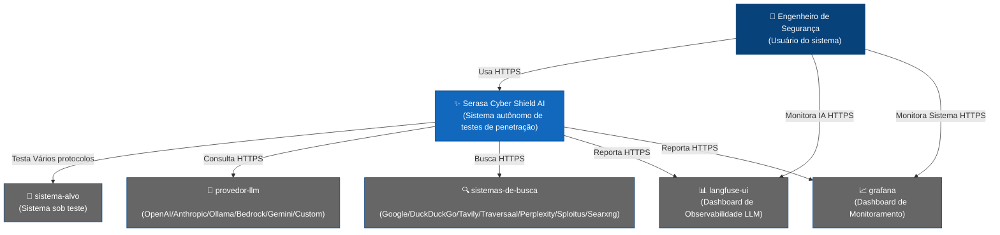

# Serasa Cyber Shield AI

<div align="center" style="font-size: 1.5em; margin: 20px 0;">
    <strong>Serasa Cyber Shield AI</strong> — Inteligência Artificial Autônoma para Testes de Penetração
</div>

## Índice

- [Visão Geral](#visão-geral)
- [Funcionalidades](#funcionalidades)
- [Arquitetura](#arquitetura)
- [Início Rápido](#início-rápido)
- [Acesso via API](#acesso-via-api)
- [Configuração Avançada](#configuração-avançada)
- [Desenvolvimento](#desenvolvimento)
- [Build](#build)
- [Licença](#licença)

## Visão Geral

Serasa Cyber Shield AI é uma ferramenta inovadora para testes de segurança automatizados que utiliza tecnologias de inteligência artificial de ponta. O projeto é voltado para profissionais de segurança da informação, pesquisadores e entusiastas que precisam de uma solução poderosa e flexível para realizar testes de penetração.

## Funcionalidades

- **Seguro e Isolado** — Todas as operações são executadas em ambiente Docker sandboxed com isolamento completo.
- **Totalmente Autônomo** — Agente alimentado por IA que determina e executa automaticamente as etapas de pentesting, com monitoramento de execução opcional e planejamento inteligente de tarefas.
- **Ferramentas Profissionais** — Suite integrada com mais de 20 ferramentas profissionais de segurança incluindo nmap, metasploit, sqlmap e mais.
- **Sistema de Memória Inteligente** — Armazenamento de longo prazo de resultados de pesquisa e abordagens bem-sucedidas para uso futuro.
- **Grafo de Conhecimento** — Integração com Graphiti e Neo4j para rastreamento de relações semânticas e compreensão avançada de contexto.
- **Inteligência Web** — Navegador integrado via scraper integrado para coleta de informações de fontes web.
- **Sistemas de Busca Externos** — Integração com APIs de busca avançadas incluindo [Tavily](https://tavily.com), [Traversaal](https://traversaal.ai), [Perplexity](https://www.perplexity.ai), [DuckDuckGo](https://duckduckgo.com/), [Google Custom Search](https://programmablesearchengine.google.com/), [Sploitus](https://sploitus.com) e [Searxng](https://searxng.org).
- **Equipe de Especialistas** — Sistema de delegação com agentes de IA especializados para pesquisa, desenvolvimento e tarefas de infraestrutura.
- **Monitoramento Completo** — Logging detalhado e integração com Grafana/Prometheus para observação em tempo real.
- **Relatórios Detalhados** — Geração de relatórios completos de vulnerabilidades com guias de exploração.
- **Gerenciamento Inteligente de Containers** — Seleção automática de imagem Docker baseada nos requisitos específicos da tarefa.
- **Interface Moderna** — Web UI limpa e intuitiva para gerenciamento e monitoramento.
- **APIs Completas** — REST e GraphQL com autenticação Bearer token para automação e integração.
- **Armazenamento Persistente** — Todos os comandos e saídas são armazenados em PostgreSQL com extensão [pgvector](https://hub.docker.com/r/pgvector/pgvector).
- **Arquitetura Escalável** — Design baseado em microsserviços com suporte a escalabilidade horizontal.
- **Solução Self-Hosted** — Controle total sobre seu deployment e dados.
- **Autenticação Flexível** — Suporte a mais de 10 provedores LLM ([OpenAI](https://platform.openai.com/), [Anthropic](https://www.anthropic.com/), [Google AI/Gemini](https://ai.google.dev/), [AWS Bedrock](https://aws.amazon.com/bedrock/), [Ollama](https://ollama.com/), [DeepSeek](https://www.deepseek.com/en/), [GLM](https://z.ai/), [Kimi](https://platform.moonshot.ai/), [Qwen](https://www.alibabacloud.com/en/), Custom) e agregadores ([OpenRouter](https://openrouter.ai/), [DeepInfra](https://deepinfra.com/)).
- **Deploy Rápido** — Configuração fácil via [Docker Compose](https://docs.docker.com/compose/).

## Arquitetura



### Componentes Principais

1. **Serviços Core** — Frontend React + TypeScript, Backend Go + GraphQL, PostgreSQL + pgvector, Fila de Tarefas Assíncrona, Sistema Multi-Agente
2. **Grafo de Conhecimento** — Graphiti API + Neo4j para rastreamento de relações semânticas
3. **Stack de Monitoramento** — OpenTelemetry, Grafana, VictoriaMetrics, Jaeger, Loki
4. **Plataforma de Analytics** — Langfuse, ClickHouse, Redis, MinIO
5. **Ferramentas de Segurança** — Web Scraper isolado, 20+ ferramentas profissionais em containers sandboxed
6. **Sistemas de Memória** — Memória de longo prazo, memória de trabalho, memória episódica, base de conhecimento, gerenciamento de contexto via sumarização de cadeia

## Início Rápido

### Requisitos do Sistema

- Docker e Docker Compose
- Mínimo 2 vCPU
- Mínimo 4GB RAM
- 20GB de espaço livre em disco
- Acesso à internet para download de imagens

### Instalação Manual

1. Crie um diretório de trabalho:

```bash
mkdir serasa-cyber-shield && cd serasa-cyber-shield
```

2. Copie o `.env.example` para `.env`:

```bash
cp .env.example .env
```

3. Crie os arquivos de configuração de exemplo:

```bash
touch example.custom.provider.yml example.ollama.provider.yml
```

4. Preencha as chaves de API necessárias no arquivo `.env`:

```bash
# Obrigatório: Pelo menos um destes provedores LLM
OPEN_AI_KEY=sua_chave_openai
ANTHROPIC_API_KEY=sua_chave_anthropic
GEMINI_API_KEY=sua_chave_gemini

# Opcional: AWS Bedrock (modelos enterprise)
BEDROCK_REGION=us-east-1
BEDROCK_DEFAULT_AUTH=true

# Opcional: Ollama (inferência local gratuita)
OLLAMA_SERVER_URL=http://localhost:11434
OLLAMA_SERVER_MODEL=nome_do_modelo

# Opcional: Buscadores adicionais
DUCKDUCKGO_ENABLED=true
SPLOITUS_ENABLED=true
TAVILY_API_KEY=sua_chave_tavily
GOOGLE_API_KEY=sua_chave_google
GOOGLE_CX_KEY=seu_cx_google
```

5. Altere as variáveis de segurança no `.env`:

- `COOKIE_SIGNING_SALT` — Altere para um valor aleatório
- `PENTAGI_POSTGRES_PASSWORD` — Altere a senha do PostgreSQL
- `NEO4J_PASSWORD` — Altere a senha do Neo4j

6. Execute a stack:

```bash
docker compose up -d
```

Acesse [localhost:8443](https://localhost:8443) para acessar a Web UI (padrão: `admin@serasacyber.com` / `admin`)

> **Nota:** É necessário configurar pelo menos um provedor de modelo de linguagem (OpenAI, Anthropic, Gemini, AWS Bedrock ou Ollama) para usar o Serasa Cyber Shield AI. Chaves de API para buscadores são opcionais mas recomendadas.

### Acesso Externo à Rede

Por padrão, o Serasa Cyber Shield AI escuta apenas em `127.0.0.1`. Para acesso externo:

```bash
# No .env
PENTAGI_LISTEN_IP=0.0.0.0
PENTAGI_LISTEN_PORT=8443
PUBLIC_URL=https://SEU_IP:8443
CORS_ORIGINS=https://localhost:8443,https://SEU_IP:8443
```

Depois recrie os containers:

```bash
docker compose down
docker compose up -d --force-recreate
```

### Configuração do Assistente

| Variável               | Padrão  | Descrição                                                          |
| ---------------------- | ------- | ------------------------------------------------------------------ |
| `ASSISTANT_USE_AGENTS` | `false` | Controla o valor padrão de uso de agentes ao criar novos assistentes |

## Acesso via API

O Serasa Cyber Shield AI oferece acesso programático completo via REST e GraphQL APIs.

### Gerando Tokens de API

1. Navegue até **Settings** → **API Tokens** na Web UI
2. Clique em **Create Token**
3. Configure nome (opcional) e data de expiração
4. Copie o token imediatamente — ele só será exibido uma vez

### Usando Tokens

```bash
# Exemplo GraphQL
curl -X POST https://seu-servidor:8443/api/v1/graphql \
  -H "Authorization: Bearer SEU_TOKEN" \
  -H "Content-Type: application/json" \
  -d '{"query": "{ flows { id title status } }"}'

# Exemplo REST
curl https://seu-servidor:8443/api/v1/flows \
  -H "Authorization: Bearer SEU_TOKEN"
```

### Documentação Interativa

- **GraphQL Playground:** `https://seu-servidor:8443/api/v1/graphql/playground`
- **Swagger UI:** `https://seu-servidor:8443/api/v1/swagger/index.html`

## Configuração Avançada

### Integração Langfuse

Para monitoramento avançado de operações dos agentes de IA:

```bash
# No .env
LANGFUSE_BASE_URL=http://langfuse-web:3000
LANGFUSE_PROJECT_ID=seu_project_id
LANGFUSE_PUBLIC_KEY=sua_chave_publica
LANGFUSE_SECRET_KEY=sua_chave_secreta
```

```bash
docker compose -f docker-compose.yml -f docker-compose-langfuse.yml up -d
```

Acesse [localhost:4000](http://localhost:4000) para a Web UI do Langfuse.

### Monitoramento e Observabilidade

```bash
# No .env
OTEL_HOST=otelcol:8148
```

```bash
docker compose -f docker-compose.yml -f docker-compose-observability.yml up -d
```

Acesse [localhost:3000](http://localhost:3000) para o Grafana.

### Grafo de Conhecimento (Graphiti)

```bash
# No .env
GRAPHITI_ENABLED=true
GRAPHITI_URL=http://graphiti:8000
GRAPHITI_MODEL_NAME=gpt-5-mini
NEO4J_USER=neo4j
NEO4J_PASSWORD=devpassword
NEO4J_URI=bolt://neo4j:7687
```

```bash
docker compose -f docker-compose.yml -f docker-compose-graphiti.yml up -d
```

### Executando Todas as Stacks Juntas

```bash
docker compose \
  -f docker-compose.yml \
  -f docker-compose-langfuse.yml \
  -f docker-compose-graphiti.yml \
  -f docker-compose-observability.yml \
  up -d
```

### Provedores LLM Suportados

| Provedor | Variável de Chave | Modelos Principais |
|---|---|---|
| OpenAI | `OPEN_AI_KEY` | GPT-5.2, GPT-4.1, o3, o4-mini |
| Anthropic | `ANTHROPIC_API_KEY` | Claude Opus 4-6, Sonnet 4-6, Haiku 4-5 |
| Google Gemini | `GEMINI_API_KEY` | Gemini 3.1 Pro, Flash, Flash Lite |
| AWS Bedrock | `BEDROCK_ACCESS_KEY_ID` | Claude, Nova, DeepSeek, Qwen, Mistral |
| DeepSeek | `DEEPSEEK_API_KEY` | deepseek-chat, deepseek-reasoner |
| GLM (Zhipu AI) | `GLM_API_KEY` | GLM-5, GLM-4.7, GLM-4.5 |
| Kimi (Moonshot) | `KIMI_API_KEY` | Kimi K2.5, K2, Moonshot V1 |
| Qwen (Alibaba) | `QWEN_API_KEY` | Qwen3-Max, Qwen3.5-Plus/Flash |
| Ollama | `OLLAMA_SERVER_URL` | Qualquer modelo local |
| Custom | `LLM_SERVER_URL` | Qualquer API compatível com OpenAI |

### Configuração de Imagem Docker

| Variável | Padrão | Descrição |
|---|---|---|
| `DOCKER_DEFAULT_IMAGE` | `debian:latest` | Imagem Docker padrão para tarefas gerais |
| `DOCKER_DEFAULT_IMAGE_FOR_PENTEST` | `kalilinux/kali-rolling` | Imagem padrão para testes de penetração |

## Desenvolvimento

### Requisitos

- Go 1.24+
- Node.js 23+
- Docker
- PostgreSQL com pgvector

### Backend

```bash
cd backend
go mod download
go run cmd/pentagi/main.go
```

### Frontend

```bash
cd frontend
npm install
npm run dev
```

### Testes

```bash
# Testes do backend
cd backend && go test -v ./...

# Testes do frontend
cd frontend && npm run test
```

### Testando Agentes LLM (ctester)

```bash
# Com Go local
cd backend
go run cmd/ctester/*.go -verbose

# Via Docker
docker run --rm -v $(pwd)/.env:/opt/serasacyber/.env serasacyber:latest /opt/serasacyber/bin/ctester -verbose
```

### Testando Embeddings (etester)

```bash
# Testar provedor de embedding
docker exec -it serasacyber /opt/serasacyber/bin/etester test

# Informações do banco de embeddings
docker exec -it serasacyber /opt/serasacyber/bin/etester info -verbose
```

### Testando Funções (ftester)

```bash
# Testar comando no terminal
cd backend
go run cmd/ftester/main.go terminal -command "ls -la" -message "Listar arquivos"

# Testar com contexto de flow
go run cmd/ftester/main.go -flow 123 pentester -message "Encontrar vulnerabilidades"
```

## Build

### Construindo a Imagem Docker

```bash
# Carregar variáveis de versão
source ./scripts/version.sh

# Build padrão
docker build \
  --build-arg PACKAGE_VER=$PACKAGE_VER \
  --build-arg PACKAGE_REV=$PACKAGE_REV \
  -t serasacyber:$PACKAGE_VER .

# Build multi-plataforma
docker buildx build \
  --platform linux/amd64,linux/arm64 \
  --build-arg PACKAGE_VER=$PACKAGE_VER \
  --build-arg PACKAGE_REV=$PACKAGE_REV \
  -t serasacyber:$PACKAGE_VER .

# Build rápido para desenvolvimento
docker build -t serasacyber:dev .
```

## Licença

Licenciado sob [MIT License](LICENSE).
